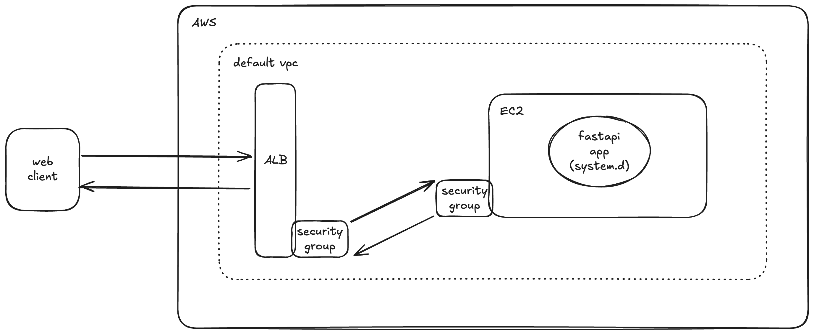

# tsai-erav4-s2

A FastAPI web-application deployed on AWS using Terraform Infrastructure as Code (IaC).

## Features

- FastAPI backend for serving APIs
- Automated AWS infrastructure provisioning with Terraform
- Application Load Balancer (ALB) and EC2 instance setup
- Security groups for ALB and EC2
- Amazon Linux 2023 AMI
- Optional SSH key pair generation
- Systemd service for FastAPI app

## Minimal Architecture Diagram



## Project Structure

```sh
.
├── __init__.py
├── internal
│   └── __init__.py
├── main.py
├── routers
│   ├── __init__.py
│   ├── index.py
│   └── upload.py
└── static
    ├── css
    │   └── style.css
    ├── img
    │   ├── cat.jpg
    │   ├── dog.jpg
    │   └── elephant.jpg
    ├── js
    │   └── app.js
    ├── templates
    │   └── index.html
    └── uploads
        └── # uploaded files

```

## Getting Started

### Prerequisites

- Python 3.11+
- [uv](https://astral.sh/uv/) for dependency management
- Terraform >= 1.4
- AWS account and credentials

### Setup

#### 1. **Clone the repository:**

   ```bash
   git clone <your-repo-url>
   cd tsai-erav4-s2
   ```

#### 2. **Create and activate a virtual environment:**

   ```bash
   uv venv
   ```

#### 3. **Install dependencies:**

   ```bash
   uv sync --frozen --no-cache
   ```

#### 4. **Configure AWS credentials:**

- Set up your AWS credentials (e.g., via `aws configure` or environment variables).

### Running Locally

#### 1. **Start the FastAPI development server:**

   ```bash
   cd app
   uv run fastapi dev --port 8000
   ```

#### 2. **Access the app:**

- Open [http://localhost:8000](http://localhost:8000) in your browser.
- API docs: [http://localhost:8000/docs](http://localhost:8000/docs)

### Deploying to AWS

#### 0. **Configure AWS Credentials**

##### Option 1: Set AWS environment variables

```bash
export AWS_ACCESS_KEY_ID="..."
export AWS_SECRET_ACCESS_KEY="..."
export AWS_SESSION_TOKEN="..."
```

##### Option 2: Add a profile to your AWS credentials file

Copy and paste the following text in your AWS credentials file (`~/.aws/credentials`)

```bash
[profile-dev]
aws_access_key_id=...
aws_secret_access_key=...
aws_session_token=...
```

#### 1. **Initialize Terraform:**

   ```bash
   cd iac
   terraform init
   ```

#### 2. **Apply Terraform configuration:**

   ```bash
   terraform apply
   ```

- This will provision the AWS infrastructure and deploy the FastAPI app.

## Customization

- Update `iac/variables.tf` variables for your AWS region, instance type, and GitHub repo URL.
